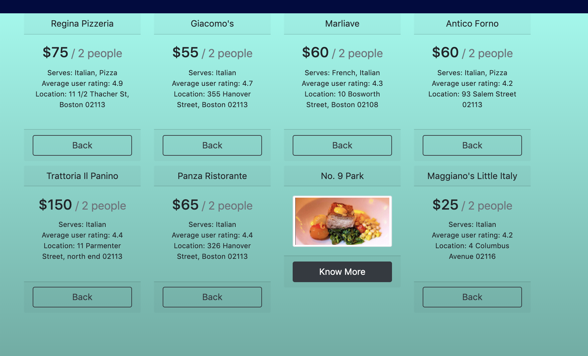

# FinalProject

### Project - What Do I Eat?

* **Create**  : As a registered user, you can add your own recipe index 
and share it with the world!
* **Discover** : Search our collection of recipes in ways you'd never have 
dreamed was possible
* **Restaurants** : Let us help you to find near by Restaurants


### Tech stack used for this project -

* Frontend - Angular 8
* Backend - NodeJs v10.16.3
* Database - MongoDB v4.2.1
* Other - RxJS, Bootstrap, Zomato API, Fontawesome


### Getting Started with Angular  

```
ng serve
```

### Getting Started with Node server  

```
node server.js
```

To start MongoDB use command - 
```
Mongo
```

### Quick Look [Before my Edits]

Login page 


Search page 


Find Restaurants 

Find Restaurants page 




